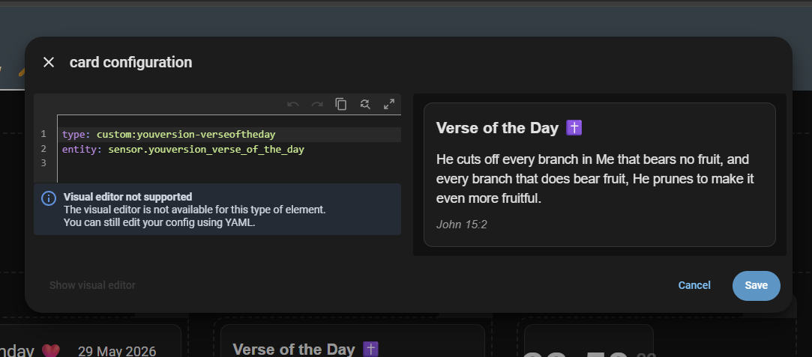

# YouVersion Verse of The Day for Home Assistan

Get Verse of the Day from YouVersion for Home Assistant.

## Overview

This repository contains a custom Home Assistant integration named `youversion` that fetches the YouVersion Verse of the Day and exposes it as a sensor.

The integration uses the YouVersion API:

- `GET https://api.youversion.com/v1/verse_of_the_days/{day}` to resolve the daily passage ID
- `GET https://api.youversion.com/v1/bibles/{bible_id}/passages/{passage_id}` to fetch the passage text

## Pre-Requisite

- `Create and app by on YouVersion DEV Platform https://developers.youversion.com/api-usage`
- `Documentation for that: https://developers.youversion.com/api-usage`

## Installation

1. Import This Repository URL in HACS
2. Restart Home Assistant.
3. Add the integration from Home Assistant's Integrations UI.

## Configuration

During setup you must provide:

- `api_key` — your YouVersion API key or bearer token

## Sensor entity

The integration creates one sensor entity:

- `sensor.youversion_verse_of_the_day`

Attributes provided:

- `reference` — human-readable Bible reference
- `passage` — Bible passage identifier, e.g. `John 3:16`

## Lovelace Card Now Supported

Create A manual Card

Add the following:

```yaml
type: custom:youversion-verseoftheday
entity: sensor.youversion_verse_of_the_day
```



## Notes

- Only One Bible Is Supported
- The integration currently uses the YouVersion `verse_of_the_days` endpoints and resolves a passage through the `bibles/{bible_id}/passages` endpoint.

## What's Next

- Add Natively on HACS instead of importing Repository
- Add Bible Version
- Add Image URL
